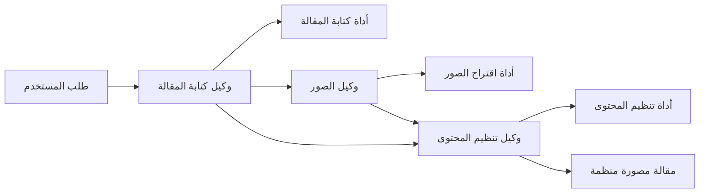

# FelasAI

FelasAI is a Streamlit multi AI agentic system for the assignment:

- Write an essay about Palestine.
- Suggest suitable images related to the topic.
- Organize the content in a clear format for the user.

## الهدف

يهدف المشروع إلى إنشاء مقالة مصورة عن **فلسطين** عبر نظام متعدد الوكلاء. يكتب النظام المقالة، يختار صورا مناسبة لمحتواها، ثم ينظم النص والصور في عرض واضح ومريح للمستخدم.

## البنية العامة

يستخدم التطبيق ثلاثة وكلاء من نوع LangChain tool-calling agents. لكل وكيل أداة متخصصة، بينما ينسق `orchestrator` انتقال المخرجات من وكيل إلى الوكيل التالي.



| الوكيل | الأداة | المخرج |
| --- | --- | --- |
| وكيل كتابة المقالة | `essay_writer_tool` | مسودة مقالة عن فلسطين |
| وكيل الصور | `image_suggester_tool` | اقتراحات صور مناسبة مع روابط صور من Wikimedia Commons |
| وكيل تنظيم المحتوى | `content_organizer_tool` | مقالة نهائية واضحة ومصورة بصيغة Markdown |

## سير العمل

1. يضغط المستخدم زر إنشاء المقالة ويحدد:
   - لغة الواجهة.
   - لغة المقالة.
   - طول المقالة.
   - عدد الصور.
2. يبدأ **وكيل كتابة المقالة** بإنتاج نص أساسي عن فلسطين باللغة المطلوبة.
3. يقرأ **وكيل الصور** المقالة المكتوبة ويقترح صورا مرتبطة بفقراتها وأفكارها.
4. تبحث أداة الصور عن روابط صور حقيقية تناسب الاقتراحات.
5. يدمج **وكيل تنظيم المحتوى** النص والصور داخل مقالة نهائية مهيأة للقراءة.
6. تعرض الواجهة المقالة للمستخدم كصفحة قراءة احترافية، مع صور مدمجة داخل السياق.

## تحسينات العرض وتجربة المستخدم

- تعرض الواجهة النتيجة كمقالة مصورة موجهة للقارئ، وليس كتقرير تقني عن تنفيذ الوكلاء.
- يظهر تقدم إنشاء المقالة خطوة بخطوة أثناء العمل:
  - كتابة المقالة.
  - اختيار الصور.
  - تنظيم المحتوى.
- تدعم الواجهة لغتين:
  - العربية.
  - English.
- يمكن اختيار لغة المقالة بشكل مستقل عن لغة الواجهة:
  - مقالة عربية.
  - مقالة إنجليزية.
- يعرض المقال العربي باتجاه قراءة مناسب `RTL`.
- تبقى تفاصيل النظام متعدد الوكلاء في الخلفية، بينما يحصل المستخدم على تجربة قراءة واضحة.

## تحسينات الصور والملحوظات

- تم تحسين وكيل الصور ليقترح صورا واقعية قابلة للعثور عليها، وليس أوصافا شاعرية أو رمزية يصعب تحويلها إلى صور فعلية.
- لا يختار وكيل الصور الصور من كلمة "Palestine" فقط، بل يقرأ المقالة المكتوبة أولا ثم يختار صورا تدعم فقراتها وموضوعاتها.
- يعتمد البحث الحالي على Wikimedia Commons للحصول على روابط صور حقيقية قابلة للعرض داخل المقالة.
- بحث الصور يجرب أكثر من صيغة بحث للصورة الواحدة لرفع فرصة العثور على نتيجة مناسبة.
- يفحص البحث عدة نتائج بدل الاعتماد على أول نتيجة فقط.
- يستبعد البحث بعض النتائج غير المناسبة غالبا لعرض المقالة، مثل:
  - الخرائط.
  - الشعارات.
  - ملفات SVG.
- تشجع تعليمات وكيل الصور على اختيار صور محددة وقابلة للبحث، مثل:
  - الأماكن والمعالم.
  - الأحداث التاريخية.
  - الحرف والثقافة.
  - الأرشيفات والمناظر الطبيعية.
- يتجنب وكيل الصور الاقتراحات الغامضة التي تحتاج إلى توليد صورة جديدة بدلا من استرجاع صورة حقيقية.
- يضع وكيل تنظيم المحتوى الصور المناسبة داخل المقالة قرب الفقرات التي تدعمها، بدلا من عرضها كمعرض منفصل فقط.
- عند توفر روابط صور صالحة، يلتزم المنظم باستخدام صورة واحدة على الأقل داخل المقالة النهائية.

## هيكل المشروع

```text
FelasAI/
|-- app.py
|-- agents/
|   |-- orchestrator.py
|-- tools/
|   |-- essay_tool.py
|   |-- image_tool.py
|   |-- organizer_tool.py
|-- requirements.txt
```

## التشغيل

1. تثبيت المكتبات:

```bash
pip install -r requirements.txt
```

2. إعداد Ollama Cloud:

```env
AI_API_KEY=your_api_key
AI_BASE_URL=https://ollama.com/v1
AI_MODEL=gpt-oss:20b
```

يمكن نسخ القيم من ملف `.env.example` إلى ملف `.env` ثم وضع مفتاح Ollama Cloud الخاص بك.

3. عند النشر على Streamlit Community Cloud، توضع القيم نفسها في قسم **Secrets** داخل إعدادات التطبيق:

```toml
AI_API_KEY = "your_ollama_cloud_api_key"
AI_BASE_URL = "https://ollama.com/v1"
AI_MODEL = "gpt-oss:20b"
```

لا ترفع ملف `.env` أو أي مفتاح API إلى GitHub.

4. تشغيل التطبيق:

```bash
streamlit run app.py --server.port 8502
```

## ملاحظة

المشروع يحقق المطلوب كنظام **Multi AI Agentic System** يستخدم أدوات متخصصة لكتابة المقالة، اقتراح الصور، وتنظيم المحتوى في صيغة مناسبة للمستخدم.
