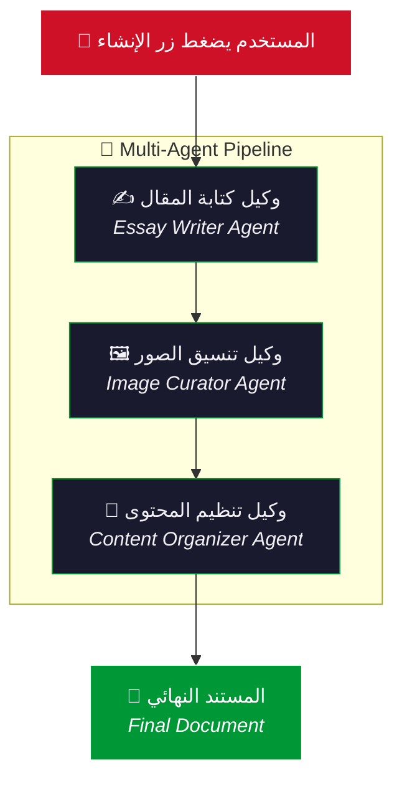
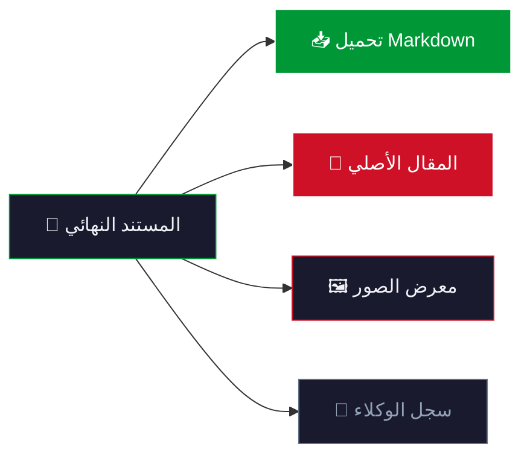

# 🇵🇸 FalesAI — Palestine Multi-Agent Content System

نظام ذكاء اصطناعي متعدد الوكلاء لإنتاج محتوى شامل ومصوّر عن **فلسطين** باستخدام LangChain + OpenRouter + Streamlit.

---

## 🎯 الهدف

إنتاج مقال شامل عن فلسطين مع صور مقترحة وتنظيم المحتوى في مستند جاهز للنشر — كل ذلك بشكل تلقائي عبر ثلاثة وكلاء ذكاء اصطناعي متخصصين.

---

## 🏗️ هيكل المشروع

```
FalesAI/
├── app.py                  # التطبيق الرئيسي (Streamlit)
├── translations.py         # ترجمات ثنائية اللغة (EN / AR)
├── requirements.txt        # المكتبات المطلوبة
├── .env                    # مفتاح OpenRouter API
├── agents/
│   ├── __init__.py
│   └── orchestrator.py     # الوكيل المنسق الرئيسي
└── tools/
    ├── __init__.py
    ├── essay_tool.py       # أداة كتابة المقال
    ├── image_tool.py       # أداة اقتراح الصور
    └── organizer_tool.py   # أداة تنظيم المحتوى
```

---

## 🔄 Workflow — خط الإنتاج



### تفصيل الخطوات

| الخطوة | الوكيل | الأداة | الوصف |
|--------|--------|--------|-------|
| **1** | ✍️ Essay Writer | `essay_writer_tool` | يستخدم OpenRouter لكتابة مقال شامل ومنظم عن فلسطين بصيغة Markdown |
| **2** | 🖼️ Image Curator | `image_suggester_tool` | يقترح صوراً ذات صلة مع عناوين وأوصاف وروابط Unsplash |
| **3** | 📐 Content Organizer | `content_organizer_tool` | يدمج المقال والصور في مستند منظم وجاهز للنشر |

---

## 🛠️ التقنيات المستخدمة

| التقنية | الاستخدام |
|---------|-----------|
| **Streamlit** | واجهة المستخدم التفاعلية |
| **LangChain** | إطار عمل الوكلاء والأدوات |
| **OpenRouter API** | واجهة برمجة النماذج المفتوحة للذكاء الاصطناعي |
| **langchain-openai** | ربط LangChain مع OpenRouter |
| **python-dotenv** | إدارة المتغيرات البيئية |
| **requests** | طلبات HTTP للصور |

---

## ⚡ التشغيل السريع

### 1. تثبيت المكتبات

```bash
pip install -r requirements.txt
```

### 2. إعداد المفتاح

أنشئ ملف `.env` في جذر المشروع:

```env
OPENROUTER_API_KEY=your_openrouter_api_key_here
OPENROUTER_MODEL=google/gemini-2.0-flash-exp:free
```

### 3. تشغيل التطبيق

```bash
streamlit run app.py --server.port 8502
```

ثم افتح المتصفح على: **http://localhost:8502**

---

## 🌐 دعم اللغات

التطبيق يدعم لغتين مع تبديل فوري:

| اللغة | الاتجاه | الخط |
|-------|---------|------|
| 🇬🇧 English | LTR ← | Inter, Playfair Display |
| 🇵🇸 العربية | RTL → | Cairo |

---

## 🔧 إعدادات متقدمة

يمكن تغيير النموذج المستخدم عبر ملف `.env`:

```env
OPENROUTER_MODEL=google/gemini-2.0-flash-exp:free    # الافتراضي (مجاني)
OPENROUTER_MODEL=openai/gpt-4o                       # نموذج أقوى (يحتاج رصيد)
OPENROUTER_MODEL=anthropic/claude-3.5-sonnet         # خيار قوي آخر
```

---

## 📊 مخرجات النظام



| التبويب | المحتوى |
|---------|---------|
| 📄 المستند النهائي | المقال + الصور منظمة في مستند واحد |
| ✍️ المقال الأصلي | النص الخام من وكيل الكتابة |
| 🖼️ معرض الصور | بطاقات الصور المقترحة مع الأوصاف |
| 🔧 سجل الوكلاء | تفاصيل تنفيذ كل وكيل |

---

## 🇵🇸

> **فلسطين حرة** — هذا المشروع مخصص لتوثيق قصة فلسطين بالذكاء الاصطناعي.

---

<div align="center">
  <sub>صُنع بـ 🤍 لفلسطين — Multi-Agent AI System · LangChain + OpenRouter + Streamlit</sub>
</div>
